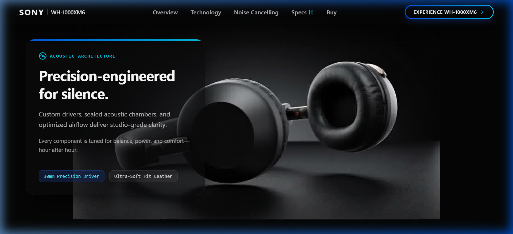
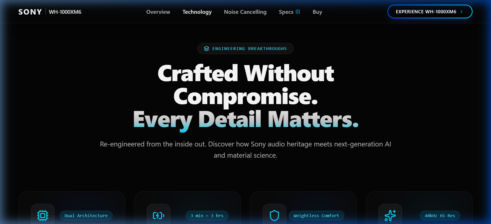
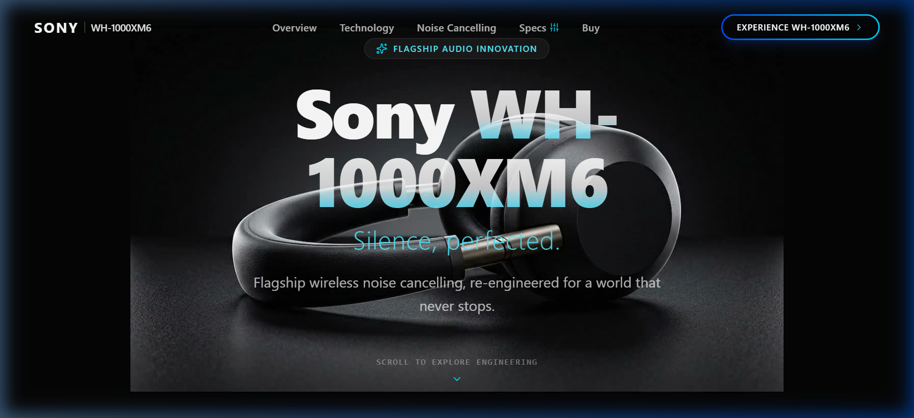

# 🎧 Sony WH-1000XM6 — Scrollytelling Landing Page

An ultra-premium, Apple/Awwwards-level scrollytelling product reveal and interactive engineering showcase built for the **Sony WH-1000XM6** flagship noise-cancelling headphones.



---

## 🌟 Key Features

- 🔄 **240-Frame Interactive Canvas Animation**: Pinned full-viewport HTML5 Canvas smoothly playing a photorealistic 240-frame sequence as the user scrolls, showing the headphones disassembling into a floating exploded technical diagram and reassembling seamlessly.
- 🎨 **Unified Edge-Free Aesthetic**: Page background color `#050505` matches image frames perfectly for zero visible border artifacts.
- 🍏 **Apple-Style Glassmorphism Navbar**: Floating translucent header with backdrop blur (`backdrop-blur-md`), smooth scroll reactivity, navigation links, and glossy cyan CTA button.
- 📜 **Narrative Storytelling Beats**: Synchronized Framer Motion text cards triggered across 5 scroll milestones (Intro, Engineering Reveal, Adaptive Noise Cancelling, Audiophile Sound, Reassembly).
- 🎛️ **Interactive Acoustic Simulator**: Real-time noise cancellation mode toggle (*Noise Cancelling*, *Ambient Sound*, *Passive Isolation*) with live SVG audio frequency attenuation waveform visualization.
- 📊 **Technical Specs Drawer**: Comprehensive slide-over modal containing complete hardware parameters (HD Processor QN2, 30mm Carbon Fiber Driver, LDAC™, DSEE Ultimate™ AI upscaling, 30h battery life).

---

## 🖼️ Screenshots

### 1. Hero Beauty Shot & Editorial Copy


### 2. Floating Technical Exploded View


### 3. Interactive Frequency Waveform Simulator


---

## 🚀 Tech Stack

- **Framework**: React 19 + TypeScript + Vite 8
- **Styling**: Tailwind CSS v4 + Custom Dark Mode Aesthetics
- **Animations**: Framer Motion + HTML5 Canvas LERP Engine
- **Icons**: Lucide React

---

## ⚡ Getting Started

1. **Install Dependencies**:
   ```bash
   npm install
   ```

2. **Run Development Server**:
   ```bash
   npm run dev
   ```
   Open `http://localhost:5173/` in your browser.

3. **Build for Production**:
   ```bash
   npm run build
   ```

---

## 🌐 Live Local Server Link

- **Local Host URL**: [http://localhost:5173/](http://localhost:5173/)
